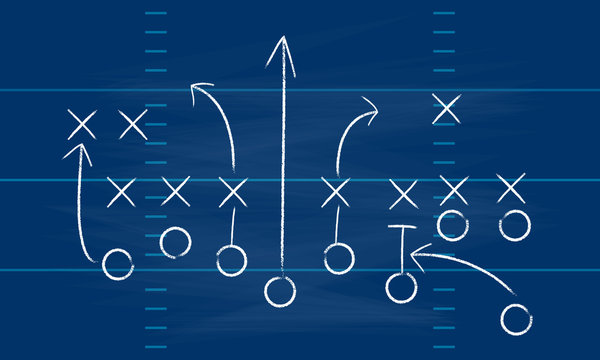
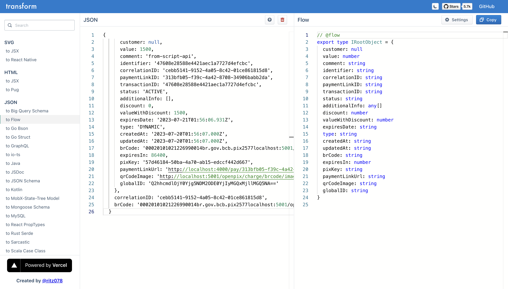

import { Head, Image, Appear } from "mdx-deck";

import Code from "./Code";
import Cover from "./Cover";
import Intro from "./Intro";
import Website from "./Website";
import Thanks from "./Thanks";
export { default as theme } from "./theme";
export * as components from "./components";
import LearnInPublic from './LearnInPublic'
import Practice from './Practice'
import Botina from "./Botina";
import BotinaHelpCommands from "./BotinaHelpCommands";
import BotinaDiff from "./BotinaDiff";
import BotinaRelease from "./BotinaRelease";
import BotinaCircleCi from "./BotinaCircleCi";

<Head>
  <link rel="preconnect" href="https://fonts.googleapis.com" />
  <link rel="preconnect" href="https://fonts.gstatic.com" crossorigin />
  <link
    href="https://fonts.googleapis.com/css2?family=Nunito:wght@400;500;700&display=swap"
    rel="stylesheet"
  />
  <link href="https://fonts.cdnfonts.com/css/cascadia-code" rel="stylesheet" />
  <title>DX with Node Js - How to improve your developing experience with Node Js</title>
</Head>

<Cover />

---

<Intro />

---

# Overview

<ul>
  <li>Introduction</li>
  <li>Learn in Public</li>
  <li>Draw and Architect</li>
  <li>Documentation</li>
  <li>Concepts</li>
  <li>APIs</li>
  <li>Test</li>
  <li>Observability</li>
  <li>References</li>
  <li>Conclusion</li>
</ul>

---

# Introduction

<ul>
    <li>Problem</li>
    <li>Why</li>
    <li>How to Improve</li>
</ul>

---

# Problem

<ul>
    <li>High Costs</li>
    <li>Heavy Developer Cycle</li>
    <li>Lacks: Documentation, Process</li>
    <li>Poor Communication</li>
</ul>

---

<LearnInPublic />

---

# Learn in Public

<ul>
  <Appear>
    <li>Write/talk about everything that you're learn</li>
    <li>Try to teach at least three different person</li>
    <li>Cone of Learning</li>
  </Appear>
</ul>

---

# Learn in Public - Read List

- [Learn in Public - by Danilo Assis](https://dev.to/daniloab/how-to-learn-in-public-9ng)
- [How to put the Learning in Public in practice - by Danilo Assis](https://dev.to/daniloab/ways-to-put-the-learning-in-public-in-practice-4h2c)
- [How to avoid frustration while learning something new - by Danilo Assis](https://dev.to/daniloab/why-getting-frustrated-is-too-boring-578p)

---

# Draw and Architect

<ul>
  <Appear>
    <li>Clear path of the problem</li>
    <li>Enhanced communication</li>
    <li>Process</li>
    <li>Tools: excalidraw, figma, mermaid</li>
  </Appear>
</ul>

---

 

---

 

---

# Documentation

 

---

# Documentation - Team

<ul>
    <Appear>
        <li>Improved Efficiency</li>
        <li>Consistency</li>
        <li>Onboarding and Training</li>
        <li>Knowledge Transfer</li>
        <li>Scalability</li>
        <li>Continuity</li>
        <li>Team Playbook</li>
    </Appear>
</ul>

---

# Documentation - Yourself

<ul>
    <Appear>
        <li>Problem Pattern Matching</li>
        <li>Consistency</li>
        <li>Personal Growth</li>
        <li>Retention and Recall</li>
        <li>Remember Things</li>
        <li>Own Playbook</li>
    </Appear>
</ul>

---

    

---

    

---

# Strategies

<ul>
    <li>Second Brain</li>
    <li>Digital Garden</li>
    <li>Zettelkasten</li>
    <li>Blog post</li>
    <li>Just take notes</li>
</ul>

---

# Second Brain

    

---

# Second Brain

    

---

<Practice />

---

# Environment

<ul>
    <Appear>
        <li>Easier to move and contribute</li>
        <li>Ship Faster</li>
        <li>Routine</li>
        <li>Playground</li>
    </Appear>
</ul>

---

# CodeSandbox

    

---

# StackBlitz

    

---

# Woovi Scripts

<ul>
    <Appear>
        <li>Collocation</li>
        <li>Scalability</li>
        <li>Reusable</li>
        <li>Maintainable</li>
    </Appear>
</ul>

---

<Code
    title="Scripts Calling API"
    code={require("!raw-loader!./code/chargePostScript.ts")}
    showNumbers={false}
    dark={true}
    lang="ts"
    steps={[
        { range: [0, 100], notes: 'Code'},
        { range: [40, 100], notes: 'Run'},
        { range: [10, 11], notes: 'Get Url'},
        { range: [12, 15], notes: 'Payload'},
        { range: [17, 26], notes: 'Subscription'},
        { range: [26,40], notes: 'Types'},
    ]}
/>

---

## Request Result - Error

    

---

## Request Result - Success

    

---

## Typing API

    

---

## Tests

<ul>
    <li>CI/CD</li>
    <li>Prevents Bugs and Regression</li>
    <li>Cost-Efficiency</li>
    <li>Integration Test</li>
    <li>Failing Tests</li>
    <li>Dev must to know what is doing it</li>
    <li>Test Driven Development</li>
</ul>

---

<Code
    title="API Test"
    code={require("!raw-loader!./code/api-test.ts")}
    showNumbers={false}
    dark={true}
    lang="ts"
    steps={[
        { range: [0, 1], notes: 'URL'},
        { range: [1, 3], notes: 'Test Description'},
        { range: [3, 8], notes: 'Fixtures'},
        { range: [9, 14], notes: 'Payload'},
        { range: [15, 22], notes: 'Request'},
        { range: [23, 30], notes: 'Payload'},
    ]}
/>

---

    

- [Building Rest APIs with koa-js](https://daniloab.github.io/build-rest-api-koa-js/#0)
- [See on Youtube Video](https://www.youtube.com/watch?v=BwTFKripKL4)

---

    

- [KoaJs CRUD - Backend implementation of REST api with Node.js, Koa.js, MongoDB and Jest Tests](https://github.com/daniloab/koa-crud-backend)

---

    

- [CI/CD - Practical Benefits](https://daniloab.github.io/cicd-talk/#0)

---

## Observability

<ul>
    <li>Automation</li>
    <li>Logs</li>
    <li>Slack</li>
    <li>Botina</li>
    <li>Instrumentation: Kibana, APM</li>
</ul>

---

<Botina />

---

<BotinaHelpCommands />

---

<BotinaDiff />

---

<BotinaRelease />

---

<BotinaCircleCi />

---

    

- [Improving Operational Work with a Slack Bot](https://daniloab.github.io/botina-slack-talk/#0)

---

    

- [Botina Slack Talk Repo](https://github.com/daniloab/botina-slack-talk)
- [Botina Slack Bot Repo](https://github.com/daniloab/botina-slack)

---

## Woovi Logging

<ul>
    <li>console.log()</li>
    <li>debugConsole()</li>
    <li>debugAggregate()</li>
</ul>

---

## Debug Console

    

---

## Debug Console

    

- [Debugging Nested Objects](https://dev.to/woovi/debugging-nested-objects-6a9)

---

## Send to Slack

    

---

## Woovi Engineer Blog

    

- [Woovi Engineer Blog](https://dev.to/woovi/)

---

## References

- [7 Principles and 10 Tactics to Make You a 10x Developer](https://thenewstack.io/7-principles-and-10-tactics-to-make-you-a-10x-developer/?utm_source=newsletter&utm_medium=email&utm_campaign=tns+top+stories)
- [How to check if a node file is running as a script?](https://dev.to/woovi/how-to-check-if-a-node-file-is-running-as-a-script-17ee)
- [apiWithLog](https://github.com/entria/apiWithLog)
- [Test Plan Driven Development](https://dev.to/woovi/test-plan-driven-development-56a2)
- [Failing Tests, Write to Fail and Fix](https://dev.to/woovi/failing-tests-write-to-fail-and-fix-1k53)
- [Testing a REST API](https://dev.to/woovi/testing-a-rest-api-43jo)
- [Shipping to Production - Series](https://dev.to/woovi/shipping-to-production-49jn)

---

<Website />

---

<Thanks />
